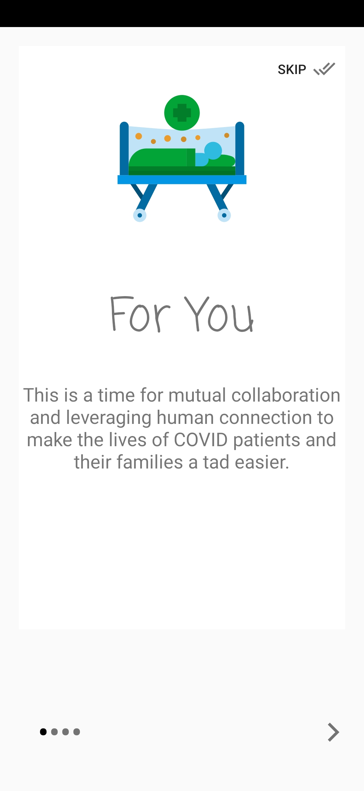
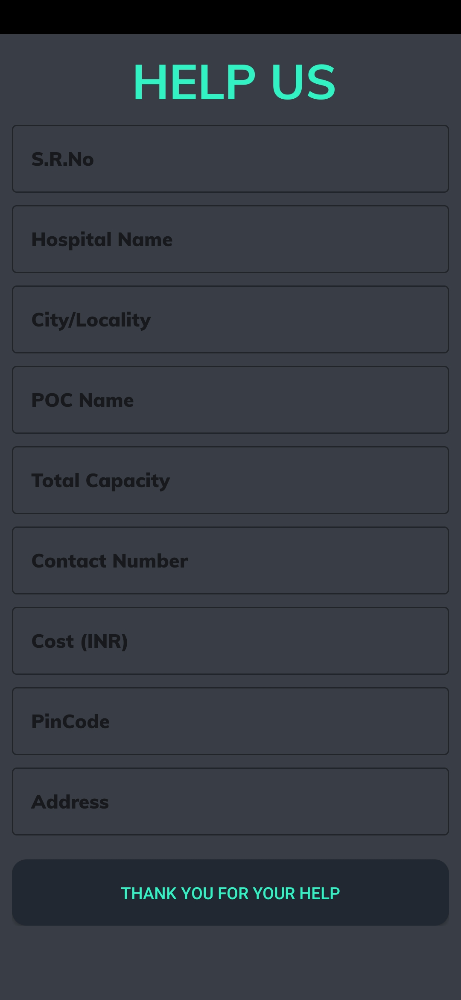
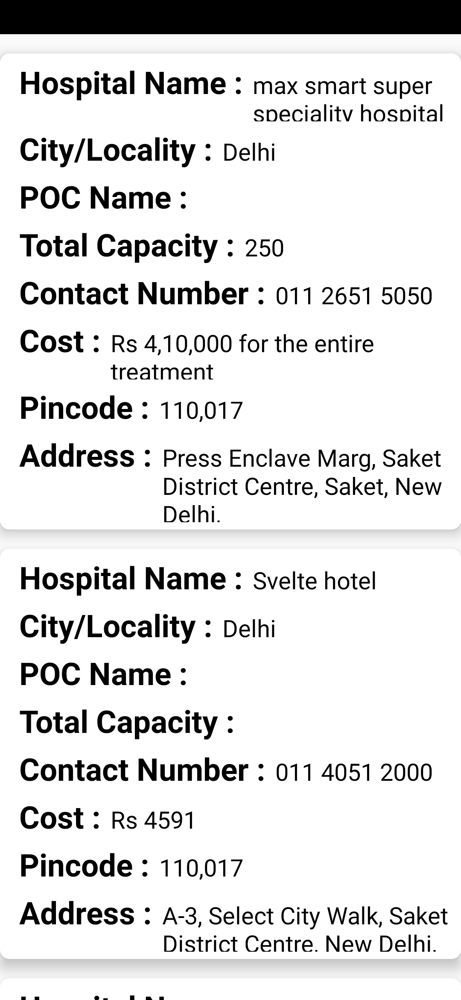

# Heplaing_Hand

I AM Rohit Kashyap From Bennett University And My Mail Id Is "RohitKashyap20005@gmail.com"

Q1 What is the app about and its purpose?

Answer :- My App Name Is Halping Hand This App Help You To Find Covid Bed Near You Just By Taping Your Fingers.

Q2 Which tech stack used?

Answer :- Languages used are Java And XML, and frameworks used is Andriod Studio.

Q3 If you have used any API key let us know the details? (Do not expose the API key in the README file)?

Answer :- Not Yet But In Future I Can.

Q4 Team/group members details to be mentioned.

Answer :- I am Individual and my name is Rohit Kashyap and I From Bennett University, CSE Student And In 2 year.
